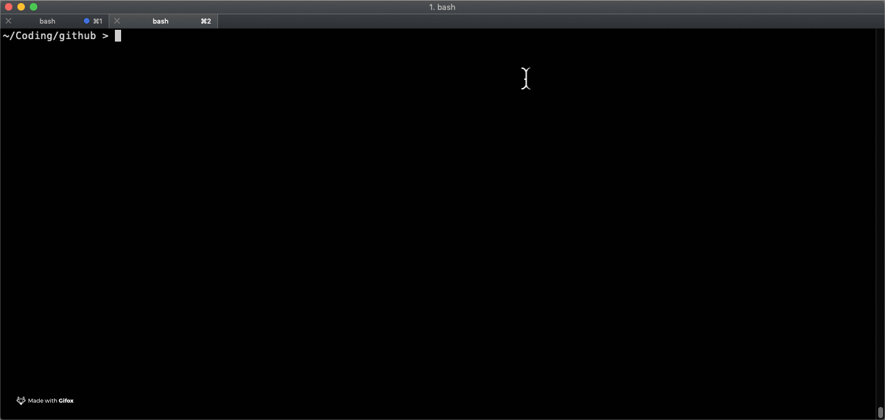

# DevEx 

## Motivation

_Developer Experience scripts, utilities and tools to help productivity_

> Note you may need to install python3 on your Mac e.g. `brew install python3`
 
## Git Status Folder Utility

A script to drop into all sub-folders and run a `git status` command, giving a summary of whether there are unsaved changes in any of them.

`./bin/gsdir.py` for running `git status` on any subfolders and finding what status they're in (only tested on Mac, assumes python3)



## Git Branch/Commit RegEx

> https://regexr.com/

Branch Naming - to enforce type/ticket/summary or release/version/summary or fixed branch names

```
^(card|feature|bug|fix|hotfix|docs|config)/[\w]+-[\d]+([/][\w-.]+)?$|^(release/v\d.\d\d.\d[\d]?)(/[\w-]+)?|(env-develop|env-stage|master)$
```

Sample data

```
release/v2.16.00
Release/v2.16.0
release/v2.16.0
release/v2.aa.0
release/v2.16.0/something-else
card/WEB-1234/something-else
fix/stix-13
fix/stix-1444
Fix/vbt-13
hotfix/stix-13
hotfix/stix-1444
HotFix/vbt-13
env-develop
env-stage
master
Fix/af-13
card/WEB-144
card/WEB-144/something
card/WEB-144/something with spaces not allowed
card/WEB-144/something-with-hyphens-allowed
feature/stix-1434
feature/stix-1434/something-cool
bug/vbtc-14
docs/abcd-123
doc/abcd-123
config/abcd-123
cfg/abcd-123
```

Commit Message - to include a JIRA ticket reference

```
(^|\s)[A-Z]+-[\d]+($|\s)
```

Sample data
```
WEB-123
 WEB-123
 WEB-123 some
web-1234
abc-1abc
commit my change from WEB-1234 and WEB-5678
sometTHIN-12
```

